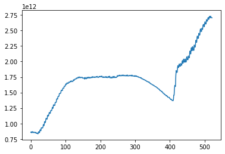
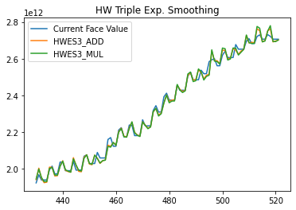
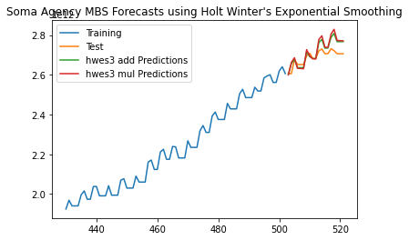

# System Open Market Account (SOMA) Forecasting

## About
This project shows end to end forecasting for Macro Agency MBS on the SOMA balance sheet.
Data was downloaded by connecting to the Federal Reserve Bank of NY Market Data API, aggregated
to net <i>Current Face Values</i>, and forecasted using Holt-Winters Exponential Smoothing.

## Market Data API
Weekly MBS data was pulled using the <i>requests</i> library and saved under [/data](/data). The API
documentation can be found here [here](api_spec.pdf)

## Aggregation
Data from each week was aggregated and saved [here](aggregate_agency_mbs.csv). The code has not been adjusted to account for release dates outside of Wednesday. Values for non-Wednesday dates appear
blank, but to temporarily resolve this, the previous non-zero aggregate is used. The unadjusted file is [here](/data/raw_aggregate_agency_mbs.csv).

## Holt-Winters Exponential Smoothing
After looking the data from 05/16/2012 to 05/11/2021  
  

the period starting at 430 weeks (08/12/2020) was used to examine possible fits.

Given the period does not have clear seasonal period, two methods (additive and multiplicative)
were chosen, and periods were set to 13 weeks (or quarterly)  
  

Seeing that both models fit relatively well to the curve, the period was broken up for
training and testing for forecast validation. The model seasonality was still set to 13 weeks.
* Training from 08/12/2020 (week 430) to 12/29/2021 (week 502)
* Testing from 01/01/2022 (week 503) to 05/11/2022 (week 521)   

  

## Mean Absolute Percentage Error (MAPE)
* 1.194% for Additive 
* 1.454% for Multiplicative

